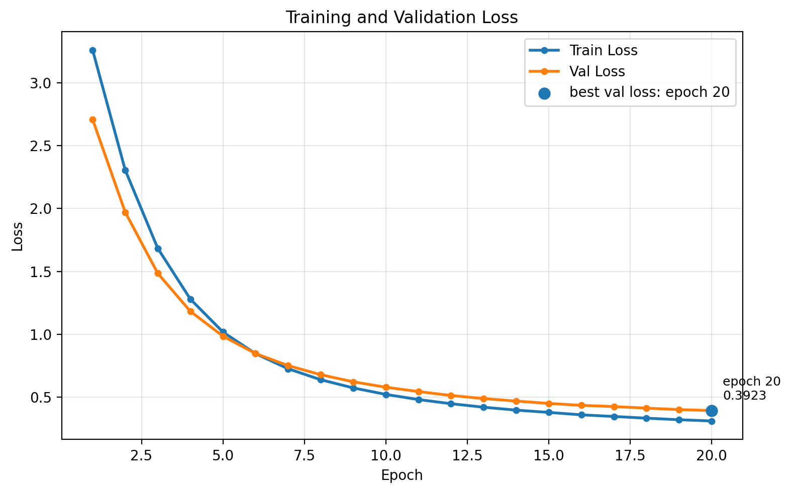
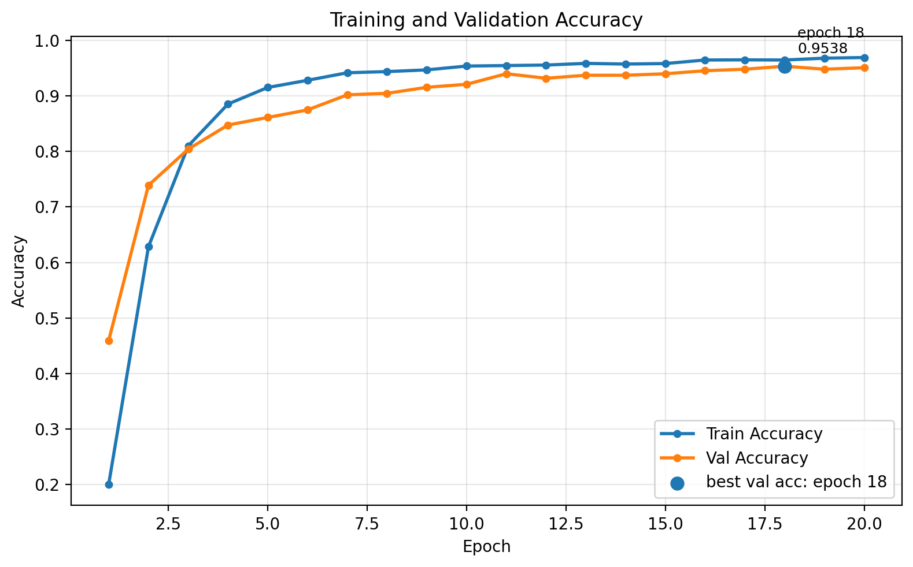

# Vision-Embed-Classifier
Vision-Embed-Classifier is a modular deep learning training system for image classification built around pretrained visual encoders.

Instead of implementing a single model script, the project demonstrates how to structure a clean, reproducible ML pipeline with configuration-driven experiments, modular data and model components, and a clear training → evaluation → inference workflow.

The classifier leverages a large pretrained vision encoder to generate embeddings and trains a lightweight classification head for downstream tasks.


## Project Structure
```bash
Vision-Embed-Classifier/
├── README.md
├── requirements.txt
├── .gitignore
├── configs/                       # Config-driven experiment definitions
│    └── experiment/
│         ├── train_baseline.yaml  # Training configuration (data/model/training hyperparameters)
│         ├── eval_baseline.yaml   # Evaluation configuration (checkpoint + evaluation settings)
│         └── infer_baseline.yaml  # Inference configuration (image input + prediction settings)
├── data/
│     └── raw/                     # Dataset root (Oxford-IIIT Pet dataset)
├── scripts/                       # Optional helper scripts for running experiments
├── src/                           # Core source code
│    ├── train.py                  # Training entrypoint: builds config → data → model → trainer
│    ├── evaluate.py               # Evaluation entrypoint: loads best checkpoint and computes metrics
│    ├── infer.py                  # Inference entrypoint: runs prediction on a single image
│    ├── data/                     # Data pipeline
│    │    ├── datasets.py          # Dataset definition and label handling
│    │    ├── transforms.py        # Image preprocessing and augmentation
│    │    └── datamodule.py        # DataModule abstraction for train/val/test loaders
│    ├── models/                   # Model architecture
│    │    ├── backbone.py          # CLIP/OpenCLIP visual encoder wrapper
│    │    ├── classifier.py        # Trainable classifier head (cosine / linear)
│    │    └── model_builder.py     # Builds full model from backbone + classifier head
│    ├── engine/                   # Training engine
│    │    ├── trainer.py           # Training loop (forward/backward/optimization)
│    │    ├── checkpoint.py        # Model checkpoint saving and loading
│    │    └── metrics.py           # Accuracy and evaluation metrics
│    └── utils/                    # Shared infrastructure utilities
│         ├── config.py            # YAML → structured experiment configuration loader
│         ├── logger.py            # Experiment logging (file + console)
│         ├── seed.py              # Global seed control for reproducibility
│         ├── paths.py             # Path resolution utilities (repo-relative paths)
│         └── visualization.py     # Training curve visualization utilities
├── artifacts/                     # Generated outputs from experiments
│    ├── checkpoints/
│    │    ├── best.pt              # Best validation checkpoint
│    │    └── last.pt              # Final checkpoint after training
│    ├── logs/
│    │    ├── clip_oxford_pet_L14.log        # Training log
│    │    └── clip_oxford_pet_L14_eval.log   # Evaluation log
│    └── figures/
│         ├── clip_oxford_pet_L14_history_acc.png   # Training / validation accuracy curves
│         └── clip_oxford_pet_L14_history_loss.png  # Training / validation loss curves
└── tests/                         # Unit tests for key components
```

## Core Design Principles 
The repository implements a modular ML system with a clear training lifecycle:
```bash
DataModule → Model Builder → Trainer → Evaluator → Inference
```
Each stage is implemented as an independent component and connected through configuration-driven experiment definitions.

The following principles guide the system design.

### 1. Modular ML Architecture

The training system is decomposed into independent modules with clear responsibilities.

- **Data pipeline** (`data/`): dataset loading, preprocessing, and dataloaders  
- **Model components** (`models/`): backbone encoder and classifier head  
- **Training engine** (`engine/`): optimization loop, metrics, checkpointing  
- **Utilities** (`utils/`): configuration loading, logging, reproducibility tools
  
This separation keeps data processing, model construction, and training logic independent, making the system easier to extend and maintain.


### 2. Configuration-Driven Experiments

All experiments are defined using YAML configuration files:
```bash
configs/experiment/
├── train_baseline.yaml
├── eval_baseline.yaml
└── infer_baseline.yaml
```
Configurations are parsed into structured dataclasses:
```bash
ExperimentConfig
├── DataConfig
├── ModelConfig
├── TrainerConfig
└── InferConfig
```
### 3. Pretrained Encoder + Lightweight Classifier
The model architecture separates **representation learning** from **task-specific classification**.

A large pretrained visual encoder generates image embeddings, while a lightweight classifier head is trained for the downstream task.

Benefits of this design include:
- strong feature representations from pretrained models
- faster convergence
- reduced training cost

### 4. Reproducible ML Workflow
Reproducibility is enforced explicitly throughout the system.

Key mechanisms include:

- **global random seed control** (`utils/seed.py`)
- deterministic dataset splitting
- configuration-based experiment definitions
- structured experiment logs

Together these ensure that training runs can be reproduced reliably across executions.

### 5. Structured Experiment Outputs

Training automatically produces several artifacts:
- **checkpoints** – best and last model states
- **logs** – detailed training and evaluation logs
- **figures** – training curves for loss and accuracy

These artifacts provide transparent experiment tracking and make debugging or comparison across runs straightforward.

## Results

This section demonstrates the full pipeline: **training → evaluation → inference**.  
The model uses a pretrained visual encoder with a **cosine classifier head**, and only the classifier head is trained while the backbone remains frozen.

### Training

Training curves show stable convergence of both loss and accuracy.
Log file: `artifacts/logs/clip_oxford_pet_L14.log`





Key observations:

- Training accuracy: **96.5%**
- Validation accuracy: **95.38%**
- Loss decreases smoothly throughout training
- Training and validation curves remain close, indicating stable optimization and minimal overfitting

Despite training **only the classifier head**, the model converges quickly thanks to strong pretrained visual embeddings.

### Evaluation

Evaluation was performed using the best checkpoint saved during training.

Log file: `artifacts/logs/clip_oxford_pet_L14_eval.log`

The test accuracy reaches **93.35%**, while:
- Train accuracy: **96.5%**
- Validation accuracy: **95.38%**

These values are very close, indicating that the training pipeline generalizes well and does not suffer from overfitting.

Note that **only half of the dataset was used as the test set**, yet the model still achieves strong performance.

### Inference Example

The repository also provides single-image inference. Example image:


Model prediction: 
```
Top-5 predictions:
1. Abyssinian (index=0, prob=0.8939)
2. Bengal (index=5, prob=0.0255)
3. Egyptian Mau (index=11, prob=0.0161)
4. Russian Blue (index=27, prob=0.0148)
5. Siamese (index=32, prob=0.0080)
```
The correct class **Abyssinian** is predicted with **89% confidence**, demonstrating that the trained classifier head can reliably map pretrained embeddings to the target label space.

## Usage 

## Outlooks
